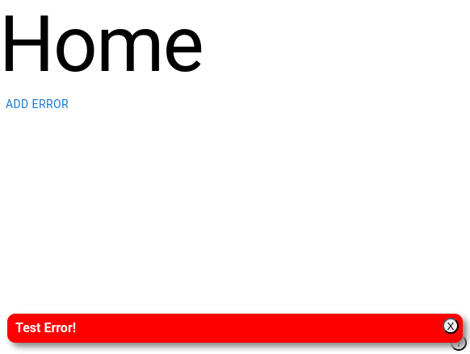

# @ouroboros/react-errors

[](https://www.npmjs.com/package/@ouroboros/react-errors) 

A React component that displays error messages.

## Installation
npm
```bash
npm install @ouroboros/react-errors
```

## Using
```javascript
import Errors, { addError } from '@ouroboros/react-errors';

function SomeComponent(props) {
  return (
    <div>
      <button onClick={() => addError('Test Error!')}>Add Error</button>
    </div>
  );
}

function App(props) {
  return (
    <SomeComponent />
    <Errors />
  );
}
```



## Props

| Name | Type | Required | Description |
|--|--|--|--|
| position | "bottom" \| "top" | no | Default, "bottom" |

## addError

The `addError` function takes a string, or an object. In the case of an object the data will be JSON stringified and then displayed in a PRE elemenent to maintain the structure.

## Style

You can set your own styles using the #oc_errors ID, or import / include `node_modules/@ouroboros/react-errors/style.css`.